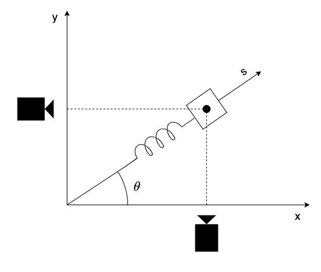

# Toy datasets

Several **example** options are provided in the sections below to give you an idea of our expectations. You may either select one of these examples (if it's relevant to your specific use case) or build your own controlled toy dataset. In both cases, you are expected to discuss your method in detail (including a critical assessment, highlighting the pros and cons of each approach).

## Regression

The aim of this proposed task is to perform a **polynomial regression** on a simple toy dataset in order to apply it to a more complex real dataset. In particular, the goal is to assess the performance of different regression models: Ordinary Least Squares (OLS), Lasso and Ridge.

### Theoretical note

The regression task can be generally described as a way to estimate the relationship between a dependent variable $y$ and an independent variable $x$. This relationship can be formulated as:

$$
y = f(x) + \epsilon
\tag{1}
$$

where $f(x)$ represents the underlying true dependency between $x$ and $y$, and $\epsilon$ is a measure of the noise introduced in the process of measuring $y$.\
In selecting the polynomial regression, we are restricting the function $f(x)$ to assume a polynomial representation:

$$
f(x) = \beta_0  + \beta_1 x + \beta_2 x^2 + \dots + \beta_p x^p
\tag{2}
$$

The training of the regression model will correspond to the selection of the $\beta_j$ parameters, such that the model's prediction 'fits' the observed values.\
The selection of the optimal parameters is equivalent to the solution of the linear system of the type $\mathbf{A} \mathbf{x} = \mathbf{b}$:

$$
\begin{bmatrix}
    1 & x_1 & x^2_1 & \dots & x^p_1 \\\
    1 & x_2 & x^2_2 & \dots & x^p_2 \\\
    \vdots & \vdots & \ddots & \vdots \\\
    1 & x_n & x^2_n & \dots & x^p_n \\\
\end{bmatrix}
\begin{bmatrix}
    \beta_0 \\\
    \beta_1 \\\
    \vdots \\\
    \beta_p
\end{bmatrix}
=
\begin{bmatrix}
    y_1 \\\
    y_2 \\\
    \vdots \\\
    y_n
\end{bmatrix}
\tag{3}
$$

The linear system admits a single solution only if the matrix $\mathbf{A}$ is invertible. This requires that $n = p$ and that $\mathbf{A}$ is a full rank matrix. In most cases, this requirement is not fullfilled and the system can admit no solutions (overdetermined system) or infinite solutions (undertermined system). In this case, the best combination of parameters $\beta_i$ is found following an optimisation process, where the objective is to minimise a loss function. The difference between OLS, Lasso and Ridge lies in the formulation of the loss function.

### Proposed task

Simulate the trajectory of a projectile with initial velocity magnitude $v_0 = 10 \  \mathrm{m/s}$ and initial position $x_0 = 0 \ \mathrm{m}, y_0 = 2 \ \mathrm{m}$ for the time it takes to reach the ground. The launch angle $\theta$ is equal to $50 \degree$. The $x$, $y$ position as well as the velocity magnitude $v = \sqrt{v_x^2 + v_y^2}$ are tracked by a sensor which has a $1 \ \mathrm{m/s}$ uncertainty in the velocity measurement and a $0.5 \ \mathrm{m}$ uncertainty in the position measurement. This is equivalent of saying that the measured value is sampled from a normal distribution with mean equal to the true value and standard deviation equal to the experimental uncertainty. The position and velocity is tracked every $0.01 \ \mathrm{s}$.
The sketch of the synthetic experiment is reported in Figure below.

The steps to solve the proposed task are:

1) Build a polynomial regression using the OLS method to predict the $y$ position of the projectile using the noisy $x$ measurements as input. The dataset containing $x$ and $y$ has to be divided into a training part and a test part. This can be done using the __train_test_split__ function in the __sklearn__ package. Usually, the test size is set to 20 % of the entire dataset.\
To perform the regression, you have to first build the matrix $\mathbf{A}$ in Eq. 3. This can be done by using the __PolynomialFeatures__ function, where you will set the degree of the polynomial to 2. After you have built the matrix $\mathbf{A}$, you will have to scale both $\mathbf{A}$ and the vector of noisy measurements $y$ using the function __StandardScaler__.
The actual regression is done using the __LinearRegression__ function, in which the parameters to input are the scaled matrix $\mathbf{A_0}$ and the vector $\mathbf{b_0}$, which contains the noisy measurements of the scaled $y$ position.\
Once the model is trained, you can judge the quality of the model by using the __score__ attribute of the model, in which you have to input the testing data. Do not forget to scale the testing data as well.
1) Build the same OLS regression model using a 20 degree polynomial. Then compare the obtained prediction with the Lasso regression model. You can use the __Lasso__ model from the __sklearn__ package. Try different values of the __alpha__ parameter.
2) The optimal value of the $\alpha$ parameter can be inferred from the data using a process called cross-validation. The function __LassoCV__ uses an iterative cross-validating algorithm to select the best value of $\alpha$. Compare the results obtained with the one obtained by manually selecting $\alpha$.
3) Repeat the same process by applying the __Ridge__ and __RidgeCV__ regressions and compare the results to the OLS results.
4) Finally, compare the Lasso and Ridge regression results in extrapolation. To do that, you can predict $y$ by using as input a vector $x$ which is 30 % bigger than the one used for training.

**Credit:** Proposed task authored by Alberto Procacci.

## Dimensionality reduction

The aim of this proposed task is to apply the POD and the DFT to analyse a simple dynamical system: the damped harmonic oscillator. POD [1] (also known as PCA or KLT) is a decomposition technique which aims at finding the structure in the dataset associated with the maximum energy. It is often used in the construction of Reduced Order Models (ROMs), because it allows the reduction of the system's dimensionality.

### Theoretical note

The POD is generally performed by applying the singular value decomposition to the dataset:

$$
\mathbf{X} = \mathbf{U} \mathrm{\boldsymbol{\Sigma}} \mathbf{V}^{T}
\tag{1}
$$

where $\mathbf{X}$ is the data matrix, $\mathbf{U}$ and $\mathbf{V}$ contain the spatial and temporal modes, and $\mathrm{\boldsymbol{\Sigma}}$ is a diagonal matrix containing the singular values. 

The goal of DFT [2] is to decompose the original dataset into a series of harmonics, using the Fourier tansform: 

$$
\mathbf{X} = \boldsymbol{\Phi}_{F} \boldsymbol{\Sigma}_{F} \boldsymbol{\Psi}_{F}
\tag{2}
$$

The DFT is not a data-driven decomposition technique, because the new basis is independent from the dataset. However, it remains very important in the study of quasi-periodic signals, because it can highlight the dominant frequencies in the dataset.

### Proposed task

The damped harmonic oscillator is a simple dynamical system in which the forces experienced by the mass are the restoring force of the spring and the dampening force of friction:

$$
m\frac{d^2s}{dt^2} + c \frac{ds}{dt} + ks = 0
\tag{3}
$$

where $m$ is the mass, $c$ is the dampening coefficient, $k$ is the spring constant and $s$ is the axis of movement. The system has an analytic solution:

$$
s(t) = A_0e^{-c/2m \ t}\cos(\omega t + \phi) 
\tag{4}
$$

where $A_0$ and $\phi$ depend on the initial conditions and $\omega = \sqrt{k/m - (c/2m)^2}$.

The steps to solve the proposed task are:

1) Construct an underdamped ($c < \sqrt{4 m k}$) harmonic oscillator with your choice of characteristic frequency and starting conditions.
2) Build a synthetic dataset by pretending that the position of the mass is tracked in time by two sensors in the $x, y$ directions. Each sensor has a 20 % uncertainty (random white noise) and the angle between the $s$ and $x$ axis is equal to $\theta = 35 \degree$, as reported in Figure below. Collect the position for $6 \ \tau$ , where $\tau = 2m/c$ is the characteristic time length. 

3) Apply the POD and DFT algorithms to the data matrix $\mathbf{X}$ containing the $x$ and $y$ positions. To perform the POD and DFT, you can use the standard python libraries (__numpy.linalg.svd()__ for the SVD algorithm and __numpy.fft.fft()__ to perform the DFT). Or, you can use the __modulo-vki__ package that you can find [here](https://github.com/mendezVKI/MODULO), along with the instruction for the installation and the documentation.
4) Compare the POD and DFT results. 

[1] Berkooz, P Holmes, and J L Lumley. The proper orthogonal decomposition in the analysis of turbulent flows. Annual Review of Fluid Mechanics, 25(1):539–575, 1993.\
[2] Julius O. Smith. Mathematics of the Discrete Fourier Transform (DFT). W3K Publishing, http://www.w3k.org/books/, 2007.

**Credit:** Proposed task authored by Alberto Procacci.

## Clustering

Uploaded soon.